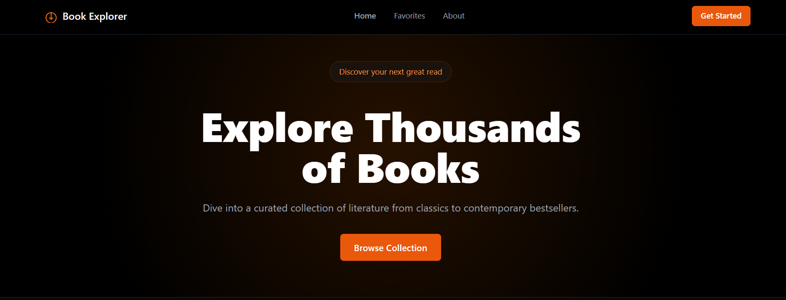
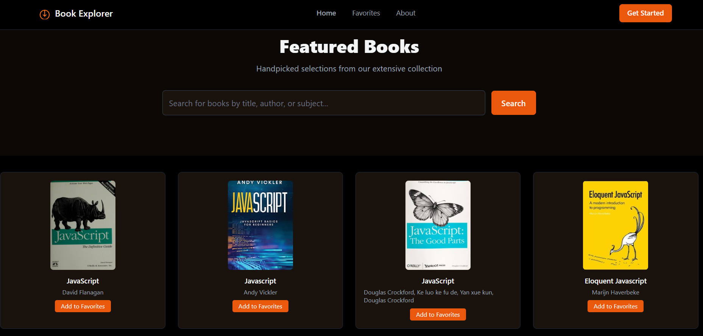
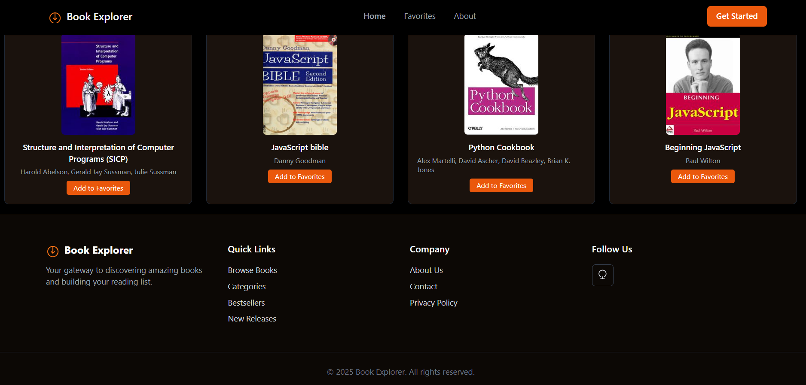
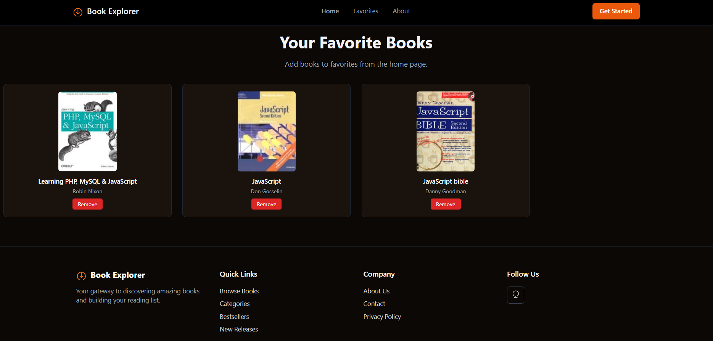
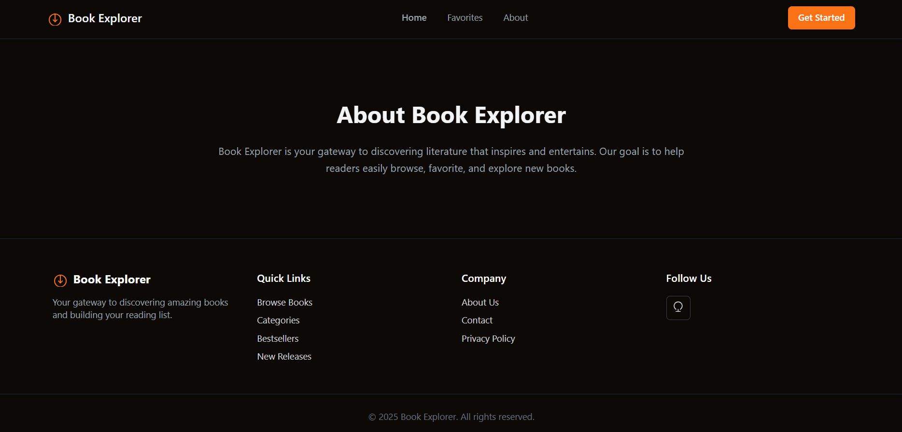

# Book Explorer

## Phase One Capstone Project

**Book Explorer** is a responsiveweb app built using **HTML**, **Tailwind Css**, and **Javascript** . It allows users to **browse books**. **add favorites**, and **view their favorites list** using **local storage**.

## features
- Browse books using the **Open library API**
- Add or remove favorites (savedin LocalStorage)
- Responsive layout with Tailwind Css
- sticky navigation bar
- Multi-page setup (Home, Favorites, About)

---

##  Main Files

lab1/
├── index.html # Homepage
├── about.html # About Page
lab2/
├── favorites.html # Favorites Page
├──favorites.js # Manages favorites

Lab3/
├── fetchBooks.js # Fetches books from API
└── main.js # Controls main logic

## Screenshots
## Home page

---

